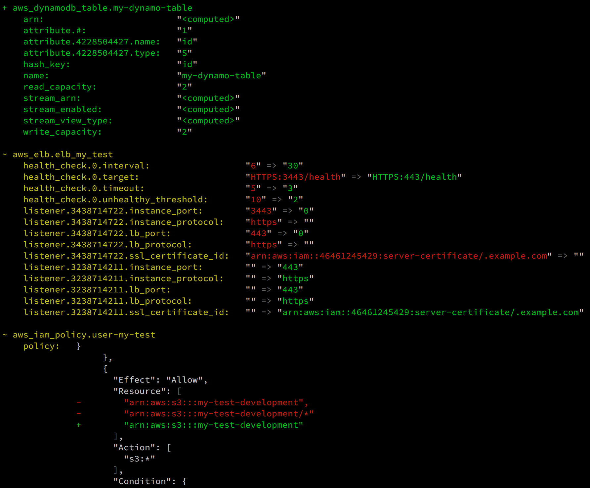

# Terraform Landscape

[](http://badge.fury.io/rb/terraform_landscape)
[](https://circleci.com/gh/coinbase/terraform-landscape)

Terraform Landscape is a tool for reformatting the output of `terraform plan`
to be easier to read and understand.

#### Before


### After


* [Requirements](#requirements)
* [Installation](#installation)
* [Usage](#usage)

## Requirements

* Ruby 2+

## Installation

The `landscape` executable is installed via [RubyGems](https://rubygems.org/).

```bash
gem install terraform_landscape
```

### macOS

Terraform Landscape is also available via [Homebrew](https://brew.sh/).

```bash
brew install terraform_landscape
```

## Usage

Pipe the output of `terraform plan` into `landscape` to reformat the output.

```bash
terraform plan ... | landscape
```

## Docker

Build the docker image using provided Dockerfile and use it directly:

```bash
docker build . -t landscape
terraform plan ... | docker run --rm landscape
```

## License

This project is released under the [Apache 2.0 license](LICENSE).
